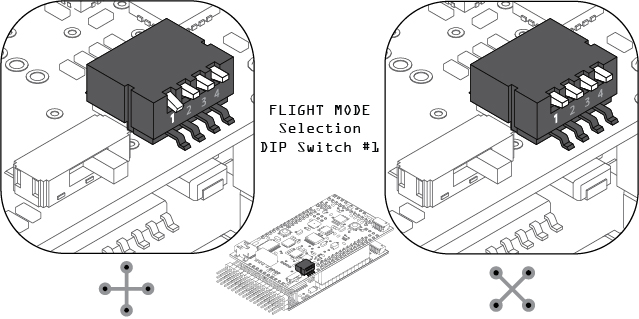
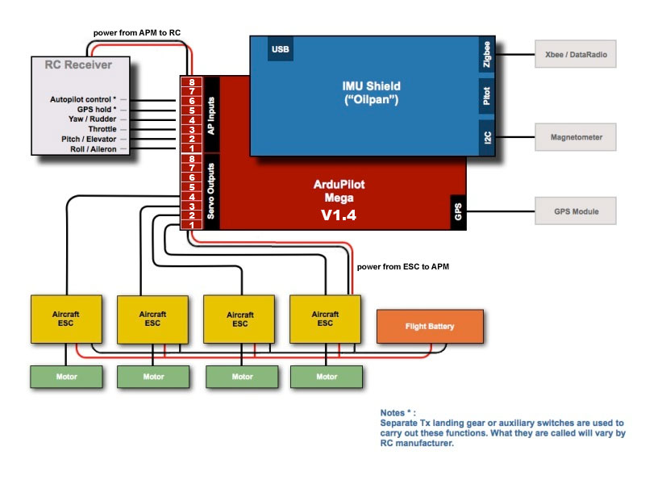
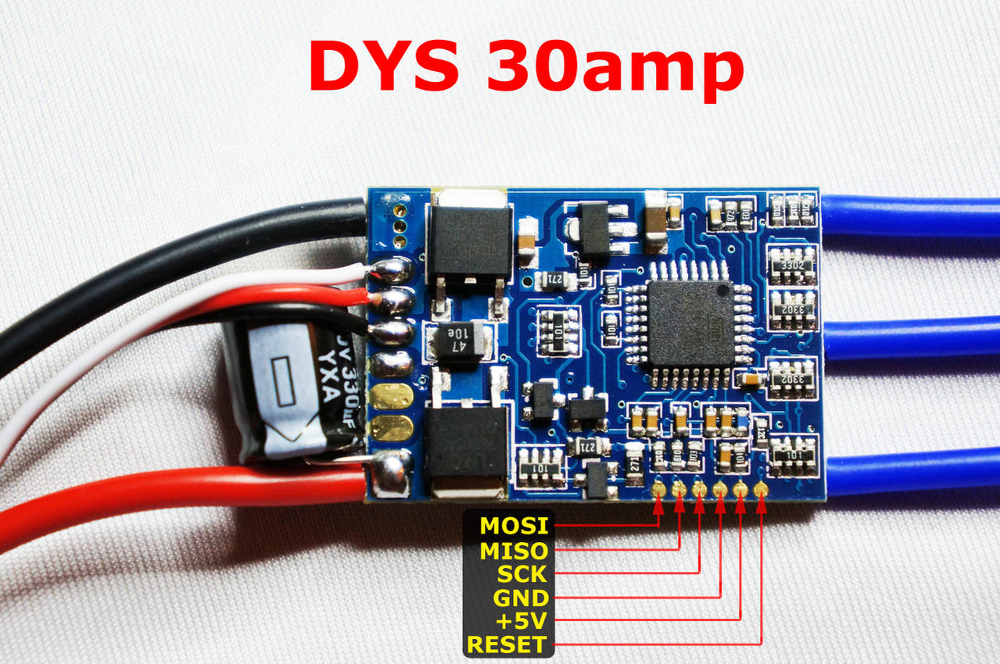
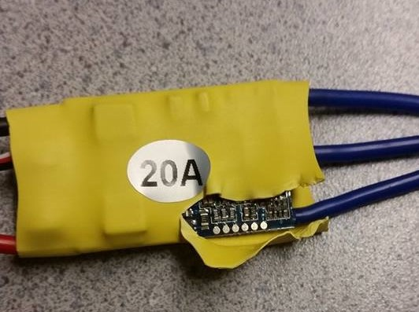
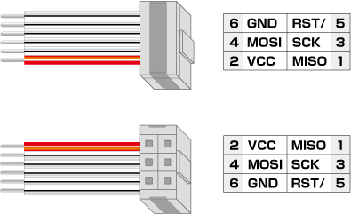
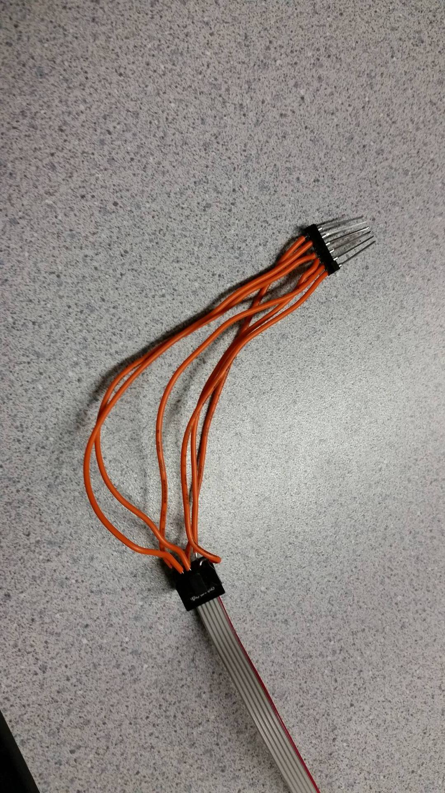
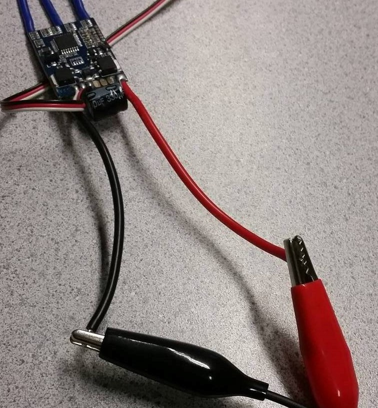
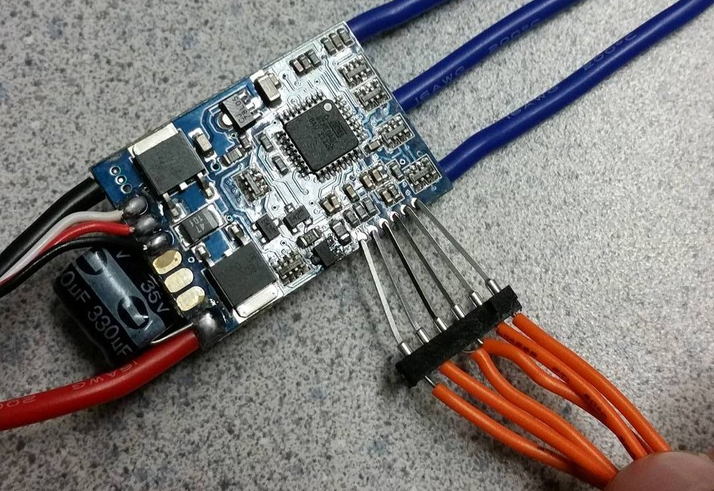
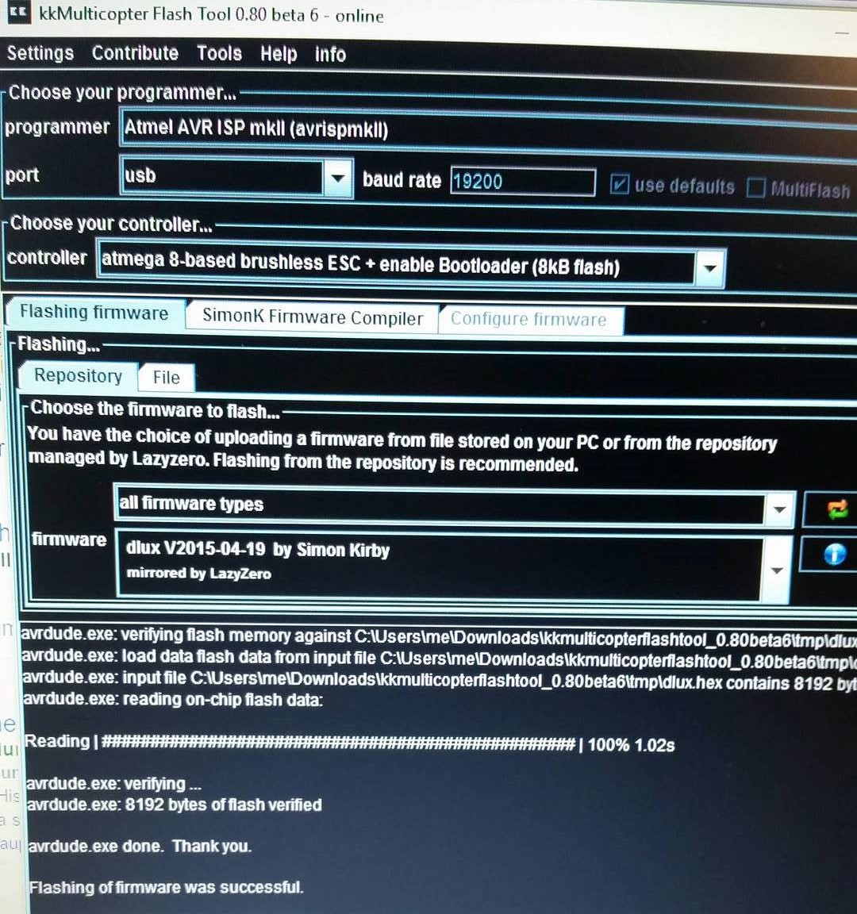

# Quadcopter Project
This project is for our Embedded systems course. Our plan is to build a QuadCopter that would be able to stabilize indoors using a camera on board that it will use an object as reference points.

We plan to achieve this using the beaglebone black running a program using OpenCV library which communicate with a Teensy board to simulate RC servo pwm commands.

##Hardware
* ArduCopter (APM 1.4)
* ESC AC30-1.0 (Jdrones 30A)
* Motors 
* GPS
* Compass (Magnetometer)
* IMU Shield/ oilpan (JD-APMIMU H V1.1A)
* Lipo Batter 4s 5000mAh 14.8v
* RC Controller (Spektrum dx8)
* RC Transmitter (AR6210)
* Xbee Pro

##Software
* Mission PLanner
* KKmulticopter Flashing tool

##Setup

###Configuration
Usually you can configure the quad in one of the following configurations:

1. The "+" configurations (one arm forward)
2. The "x" configurations (two arms at 45 degrees on either side of the direction)  

We chose to use the "x" configuration as it will make it easier for us to calibrate.

The way to select which mode you want is with the DIP switch on the IMU board:

###Connections
 

N.B that these are the default connections prior to the changes made to the parameters.

###Motor Setup
Configuring the motor directions:

1. The ESCs have three blue output connections, connect all of them the same way.
2. Observed the direction they turn in. 
3. Switch any two of the wires to reverse the direction of the motors to much the diagram below. 

 
N.B The motor numbers correspond to the pin numbers on the APM, Do not use the Motor Test to Identify the motors.

###RC Setup
The remote control and transceiver need to be binded as follows:

1. Attach the binding jumber cable to the transceiver, the light should start blinking.
2. Turn off power controller.
3. Power on the controller while pressing the Training button on top of the controller until the light on the transceiver turns solid. 

##Modifications

###ESC
The ESC is usually sold with a firmware that limits its refresh speed to  8khz. We decided to flash it with SimonK firmware that allows the refresh speed to reach 400khz which allows more control on the motors.

How it's done:

1. Identify ESC and its ISP connections 
 
2. Remove Cover just enough to access the SPI pads 
 
3. Modified the connection from an avrisp mkii programmer to be able to connect to the ESC (MISO, MOSI, REST, VCC, GND) 
 
 
 
4. Connect ESC to power (6-16v)
 
5. Attach connection to the pads in the correct position
 
6. Using KKmulticopter Flashing tool, flash with the latest SimonK firmware TYG version 
 

###Communication

Initially the arducopter was only setup to recieve telemetry while connected through the usb connector. We soldered telemetry pins on board in order to connect an Xbee pro on board for two-way communication between our laptop and Apm.
 

In order for this to work the Xbees need to be configured to 57600 Baud rate and binded together.
To bind the Xbees properly follow the following steps:

1. Connect the first Xbee and run XCTU.
2. Read the device configuration and record the Serial number of the Xbee
3. change the Pan ID to #### for digits of your choice.
4. Change to Coordinator
5. Disconnect the first Xbee and connect the second Xbee
6. Change the Pan ID to the same 4 digits chosen previously
7. Change the DH to the first 6 digits of the serial number of the first Xbee
8. change the DL to the rest of the serial number of the first Xbee
9. change the Xbee to End

###Parameter changes
Changes to the default parameter in Arducopter can be written using the mission planner.
* Changed RC pins for Throttle, Yaw, Pitch and Roll to correspond with RC transciever. (channel 7, 6, 5 and 4)

###Calibration
####1. RC Calibration.
####2. Compass Calibration.
####3. Motor and Compass calibration.
####4. Accelerometer Calibration.
####5. ESC Calibration
Calibrating ESCs individually 

1. Plug one of your ESC three-wire cables into the throttle channel of the RC receiver. (This is usually channel 3.)
2. Turn on the transmitter and set throttle stick to maximum (full up).
3. Connect the LiPo battery
4. You will hear a musical tone then two beeps.
5. After the two beeps, lower the throttle stick to full down.
6. You will then hear a number of beeps (one for each battery cell you’re using) and finally a single long beep indicating the end points have been set and the ESC is calibrated.
7. Disconnect battery. Repeat these steps for all ESCs.
8. If it appears that the ESC’s did not calibrate then the throttle channel on the transmitter might need to be reversed.
9. If you are still having trouble after trying these methods (for example, ESCs still beep continuously) try lowering your throttle trim 50%.
10. You can also try powering your APM board via the USB first to boot it up before plugging in the LiPo.

#####Testing
Once you have calibrated your ESCs, you can test them by plugging in your LiPo.  Remember: no propellers!

1. Ensure your transmitter’s flight mode switch is set to “Stabilize Mode”.
2. Arm your copter
3. Give a small amount of throttle.  All motors should spin at about same speed and they should start at the same time. If the motors do not all start at the same time and spin at the same speed, the ESC’s are still not properly calibrated.
4. Disarm your copter

##Issues and Failures
1. Initially we thought that since the ESCs we have are similar to the DYS designs that they should be flashed with SimonK's DYS N-FET bu that was a mistake, because these ESC's are quite different.
2. Motors started spinning slightly after Arming, disabled MOT_SPIN_ARMED parameter. 
3. Motors don't start spinning at the same time. ESC need to be calibrated.
4. During flight test DMC_BAD_HEADING error and unstability. We had the quadcopter suspended by a rope and it was vibrating and a common issue with the IMU/OilPan is that It decalibrates due to excessive vibration and rotation.
5. RC calibration Fails and needs to be adjusted Manually.
6. During the Flight test the quad didn't stabilize and tended to flip on one side. Check Motors (order, Direction and ESC calibration). We had configured the motors using the motor test in the mission planner, thinking that the order (A-B-C-D) corresponds to the motor numbers (1-2-3-4) but it turns out the motor test order each motor rotating clockwise around the quad.

##References
1. APM archived manual- https://code.google.com/p/ardupirates/wiki/RC 
2. Drivers for AVRISP- http://zadig.akeo.ie/
3. ESC Flashing- http://www.rchacker.com/diy/simonk-esc-firmware-flashing
4. Xbee 2-way communication- http://www.ardupilot.co.uk/guide/ardupilot-mega-telemetry-kit-2-way-communications-with-your-uav
5. ESC firmware Database- https://docs.google.com/spreadsheet/ccc?key=0AhR02IDNb7_MdEhfVjk3MkRHVzhKdjU1YzdBQkZZRlE#gid=0

